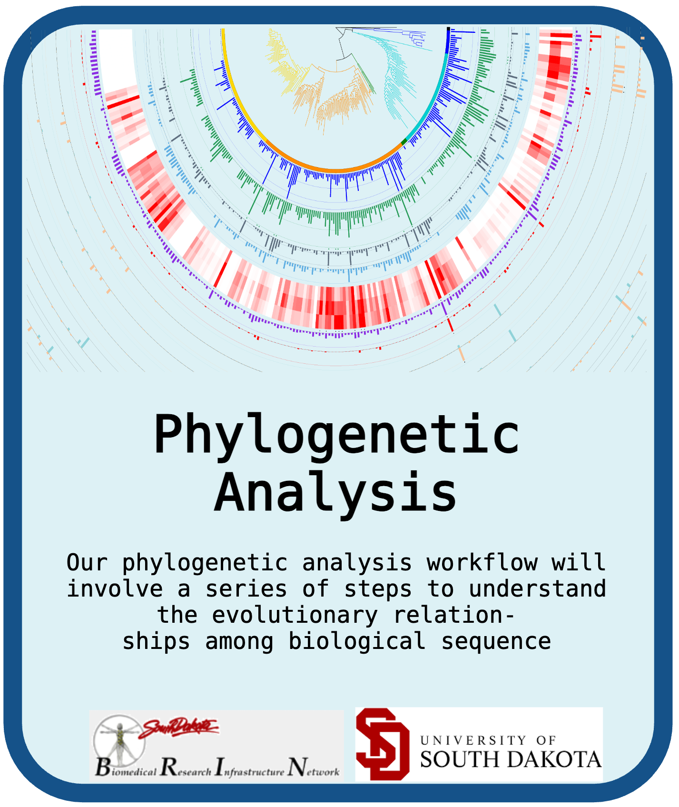
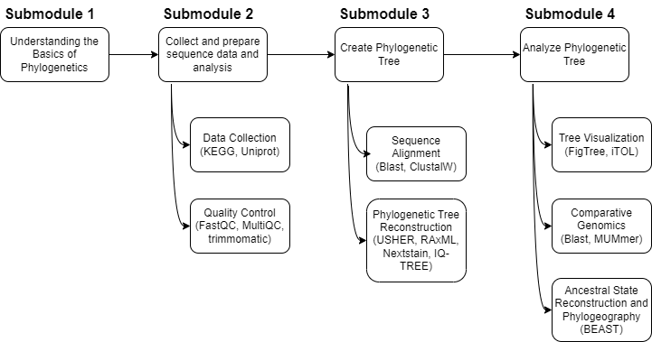
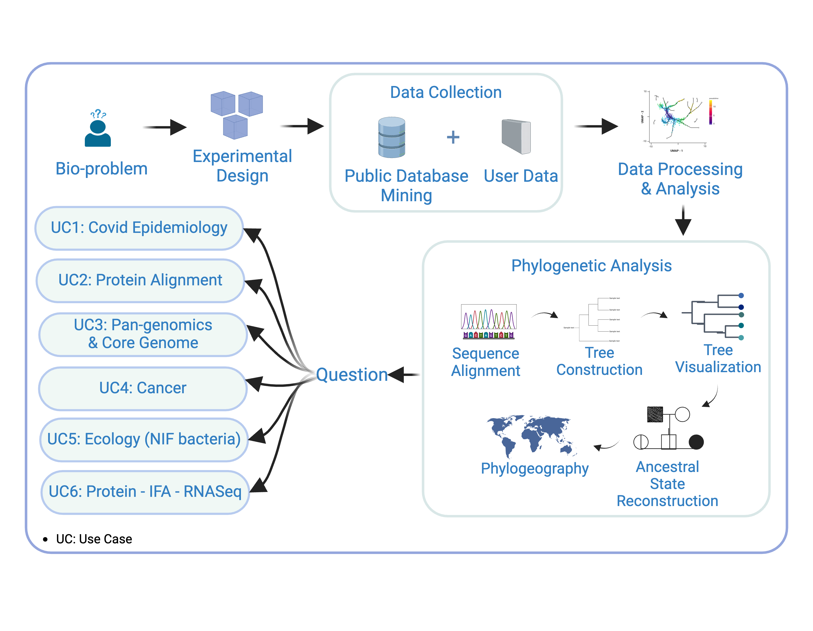

# University of South Dakota: Phylogenetic Analysis

## Contents

- [Overview](#overview)
- [Learning Objectives](#learning-objectives)
- [Getting Started](#getting-started)
- [Software Requirements](#software-requirements)
- [Workflow Diagrams](#workflow-diagrams)
- [Submodule 1 Understanding the Basics of Phylogenetic](#submodule-1-understanding-the-basics-of-phylogenetic)
- [Submodule 2 Collect and Prepare Sequence Data and Analysis](#submodule-2-collect-and-prepare-sequence-data-and-analysis)
- [Submodule 3 Construct Phylogenetic Tree](#submodule-3-construct-phylogenetic-tree)
- [Submodule 4 Analyze Phylogenetic Tree](#submodule-4-analyze-phylogenetic-tree)
- [Data](#data)
- [Troubleshooting](#troubleshooting)
- [Funding](#funding)
- [License for Data](#license-for-data) 

## **Overview**
This README should walk the learner through the background and steps necessary to complete this training module. To use our module, clone this repo using `git clone https://github.com/bicbioeng/nosi-phylogeny-draft.git` and then navigate to the directory for this project.

The study and understanding of phylogenetic trees have become an indispensable part of modern biological research. Phylogenetic trees provide profound insights into the evolutionary relationships between. They also help in understanding the spread of diseases, such as the origin and evolution of pathogens, the time and space distribution of prevalence, and the prediction of pathogen transmission trends. Additionally, phylogenetic trees are used to study the functional genomics of various species, including the emergence of new body plans or metabolism, molecular adaptation, morphological character evolution, and demographic changes in recently diverged species. The advancement of sequencing technologies has greatly contributed to the analysis of phylogenetic trees, allowing for the analysis of large datasets, including whole genomes. Overall, phylogenetic trees play a crucial role in various biological disciplines, providing valuable insights into the evolutionary history and functional genomics of organisms.

This README describes the tutorials in our step-by-step analytic workflow. These submodules cover the end-to-end workflow of a standard phylogenetic analysis, starting at extracting a gene sequence to creating a phylogenetic tree to analyzing the tree.

## **Learning Objectives:**
The phylogenetic analysis modules will serve for undergraduate through graduate level.

L01: Comprehensive Phylogenetic Analysis for Disease Dynamics
This learning objective aims to provide participants with the knowledge and skills needed to utilize phylogenetic trees in understanding the spread of diseases. By the end of this module, participants will be able to trace the origin and evolution of pathogens, analyze the distribution of disease prevalence over time and space, and predict trends in pathogen transmission using phylogenetic analysis.

L02: Phylogenetics in Functional Genomics and Evolutionary Studies
This learning objective is designed to enable participants to apply phylogenetic analysis to study the functional genomics of various species. Participants will learn how to investigate the emergence of new body plans, molecular adaptations, and morphological character evolution, as well as understand demographic changes in recently diverged species through the construction and interpretation of phylogenetic trees.

The course consists of 4 learning submodules:

*Submodule #1: Understanding the Basics of Phylogenetic*  
*Submodule #2: Collect and Prepare Sequence Data and Analysis*  
*Submodule #3: Construct Phylogenetic Tree*  
*Submodule #4: Analyze Phylogenetic Tree* 

## **Software Requirements**

Our Analysis Workflow Toolkits includes the following tools: 
- Jupyther Notebook
- FastQC
- Nextstrain Augur
- ClustalW
- USHER
- MAFFT
- iTOL
- Blast
- BEAST

Each dependency will be loaded at the beginning of the module and will allow the user to understand the context in which the package is relevant to our analytic process.

## **Workflow Diagram**

## Bioinformatics Workflow Diagrams

Figure 2: Our learning objectives encompass a comprehensive understanding of phylogenetic analysis, from data collection and
preparation to tree construction and interpretation, enabling participants to conduct meaningful analysis in diverse metagenomic
context

## General Overall Process

## Submodule 1: Understanding the Basics of Phylogenetics

In this submodule, learners will be introduced to the fundamental concepts of phylogenetic trees, which represent evolutionary relationships among species or organisms. These trees are based on physical traits and genetic data and serve as hypotheses about the evolutionary history of the organisms studied.

### Key Topics Covered:
- **Definition and Purpose of Phylogenetic Trees**: Understanding how they map evolutionary connections, trace genetic changes, and study biodiversity.
- **Types of Phylogenetic Trees**: Learn about rooted and unrooted trees, cladograms, phylograms, and dendrograms.
- **Data Sources for Phylogenetic Trees**: Explore various sources like genetic sequences, public databases, and sequencing technologies for constructing phylogenetic trees.
- **Applications of Phylogenetic Trees**: Insights into their role in evolutionary biology, biodiversity research, and disease tracking.

This submodule sets the foundation for subsequent modules by establishing a clear understanding of how phylogenetic trees are constructed and their significance in evolutionary studies.

## Submodule 2: Collect and Prepare Sequence Data for Analysis

This submodule demonstrates the process of collecting and preparing genetic sequence data for phylogenetic tree analysis, with a focus on practical tools and cloud-based solutions.

### Key Topics Covered:
- **Efficient Methods for Sourcing Sequences**: Using public databases like GenBank and automated tools (e.g., Entrez Direct, Biopython) for efficient sequence retrieval.
- **Data Cleaning and Preprocessing**: Implementing tools such as Trimmomatic for quality control, trimming low-quality reads, and preparing sequences for alignment.
- **Sequence Alignment**: Using tools like MAFFT or ClustalW to align sequences and ensure accurate phylogenetic analysis.
- **Cloud-Based Storage Solutions**: Discussion on the scalability, accessibility, and cost-effectiveness of cloud-based systems for managing large metagenomic datasets.
- **Data Integrity Checks**: Implementing quality control checks using tools like FastQC to ensure data quality before analysis.

By the end of this submodule, learners will have hands-on experience sourcing, cleaning, and preparing data for constructing accurate phylogenetic trees.

## Submodule 3: Construct Phylogenetic Tree

In this submodule, learners will walk through the process of constructing a phylogenetic tree from gene sequence data. The key steps include performing sequence alignment and reconstructing the phylogenetic tree using different tools and techniques.

### Key Topics Covered:
#### 3.1 Perform Accurate Sequence Alignment using ClustalW and Augur:
Sequence alignment arranges sequences to highlight similarities and differences. This submodule demonstrates how to perform sequence alignment using ClustalW and Augur.
- **Augur**: Used for aligning metagenomic data, especially SARS-CoV-2 sequences, preparing them for phylogenetic tree construction.
- **ClustalW**: A tool for aligning multiple sequences. Learners will install and run ClustalW via Python's Biopython library and analyze the results.
- **Command Execution**: A detailed explanation of the necessary steps to install the tools, prepare the input FASTA files, and execute sequence alignment.

#### 3.2 Manage Computational Intensity through Cloud Computing:
Sequence alignment can be computationally expensive. This section covers how to handle large metagenomic datasets using cloud computing to scale resources efficiently.
- **Benefits**: Cloud computing offers scalability, cost-effectiveness, and accessibility, enhancing the computational power for sequence alignment and phylogenetic analysis.

#### 3.3 Phylogenetic Tree Reconstruction using USHER:
USHER (Ultrafast Sample Placement on Existing tRee) is a tool used to place samples onto a pre-existing phylogenetic tree rapidly.
- **Tree Reconstruction**: Learners will clone the USHER repository, install necessary dependencies, and perform phylogenetic tree reconstruction using aligned sequences. The final output is a Newick tree file representing the evolutionary relationships between the sequences.

### Tools and Dependencies:
- **Augur**: Nextstrain alignment tool for metagenomic sequences.
- **ClustalW**: Sequence alignment tool.
- **MAFFT**: Multiple sequence alignment software.
- **FastTree**: For creating Newick tree files.
- **USHER**: A tool for rapid phylogenetic tree placement.

This submodule provides hands-on experience with multiple tools for phylogenetic tree construction and highlights how to use cloud resources to manage the computational requirements.

## Submodule 4: Analyze Phylogenetic Tree

In this submodule, learners will analyze phylogenetic trees by interpreting evolutionary relationships, investigating genomic diversity, and conducting comparative studies using multiple visualization tools. The primary focus will be on understanding tree topology and applying this knowledge to various biological questions.

### Key Topics Covered:
- **Introduction to Phylogenetic Tree Analysis**: Overview of phylogenetic tree structures, understanding branching patterns, and how to interpret evolutionary relationships from tree topology.
- **Tree Visualization with IQ-TREE and iTOL**: IQ-TREE will be the primary tool for visualizing phylogenetic trees, with iTOL provided as an alternative. Learners will install and configure IQ-TREE, generate visual representations, and apply iTOL to explore additional visualization features.
- **Comparative Genomics Analysis**: Using the constructed phylogenetic trees to compare genomic features across species, identify conserved regions, and infer functional implications.
- **Ancestral State Reconstruction**: Estimating ancestral traits and character states for evolutionary inference, utilizing tree topology to explore evolutionary paths and changes.
- **Detecting Phylogenetic Signals**: Techniques for identifying evolutionary signals and trends in sequence data, assessing significance, and interpreting evolutionary relationships.

### Tools and Dependencies:
- **IQ-TREE**: Main tool for phylogenetic tree visualization and statistical analysis.
- **iTOL (Interactive Tree of Life)**: Alternative visualization tool that offers additional interactive features for tree exploration.

This submodule enables learners to gain hands-on experience in analyzing and interpreting phylogenetic trees, with the goal of drawing meaningful insights about evolutionary patterns and species relationships.

## Data
This training module will use 6 different datasets to cover the diversity of our problem for each of the use cases shown.
- UC1(Covid Epidemiology): --
- UC2(Protein Alignment): --
- UC3(Pan-genomics & Core Genome): --
- UC4(Cancer): --
- UC5(Ecology (NIF Bacteria)): --
- UC6(Protein - IFA - RNASeq): --

## Troubleshooting

Common errors encountered in this workflow include: 
1. Missing file. This error can have multiple causes:
    - Wrong file path: Find the correct file in notebook directories, then update the correct file path.
    - File does not exist: Find path in the provided bucket or notebook and update command.
    - File was not generated: Check previous steps make sure previous step run successfully.
2. ----

## Funding

Funded by the South Dakota INBRE Program NIH/NIGMS P20 GM103443.

## License for Data

All data and download files in STRING-DB are freely available under a 'Creative Commons BY 4.0' license.

Text and materials are licensed under a Creative Commons CC-BY-NC-SA license. The license allows you to copy, remix and redistribute any of our publicly available materials, under the condition that you attribute the work (details in the license) and do not make profits from it. More information is available [here](https://tilburgsciencehub.com/about/#license).

This work is licensed under a [Creative Commons Attribution-NonCommercial-ShareAlike 4.0 International License](http://creativecommons.org/licenses/by-nc-sa/4.0/)

