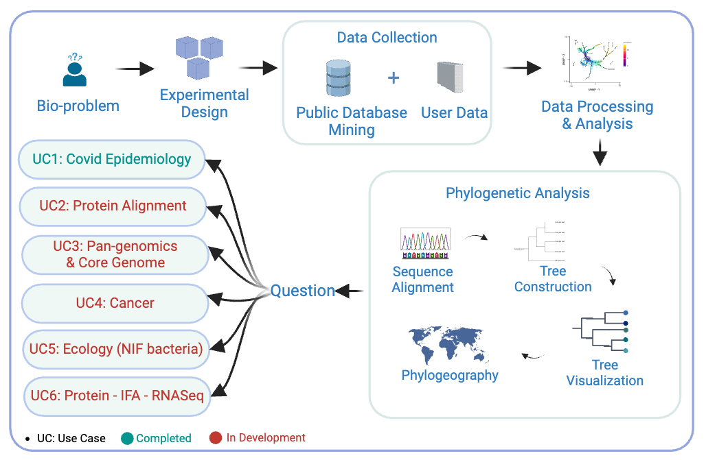

# University of South Dakota: Phylogenetic Analysis

---

## Contents

---

- <u>[Overview](#overview)</u>
- <u>[Background](#background)</u>
- <u>[Before Starting](#before-starting)</u>
- <u>[Getting Started](#getting-started)</u>
- <u>[Software Requirements](#software-requirements)</u>
- <u>[Architecture Design](#architecture-design)</u>
- <u>[Data](#data)</u>
- <u>[Funding](#funding)</u>
- <u>[License for Data](#license-for-data)</u>

## Overview

The study and understanding of phylogenetic trees have become an indispensable part of modern biological research. Phylogenetic trees provide profound insights into the evolutionary relationships between species, genes, or populations. They also help in understanding the spread of diseases, including:

- The origin and evolution of pathogens.
- The time and space distribution of disease prevalence.
- The prediction of pathogen transmission trends.

Additionally, phylogenetic trees are used to study functional genomics, such as:

- The emergence of new anatomical structures (body plans), which define the overall organization of an organism's body.
- Metabolism and molecular adaptation.
- Morphological character evolution.
- Demographic changes in recently diverged species

The advancement of sequencing technologies has significantly enhanced phylogenetic analysis, enabling the study of large datasets, including whole genomes. Overall, phylogenetic trees play a crucial role in various biological disciplines, offering valuable insights into evolutionary history and functional genomics.

---

## Background

These submodules cover the end-to-end workflow of a standard phylogenetic analysis, starting at extracting a gene sequence to creating a phylogenetic tree to analyzing the tree.
The phylogenetic analysis modules will serve for undergraduate through graduate level.

**Provide the knowledge and tools to conduct comprehensive phylogenetic analysis for disease dynamics:**

This learning objective aims to provide participants with the knowledge and skills needed to utilize phylogenetic trees in understanding the spread of diseases. By the end of this module, participants will be able to trace the origin and evolution of pathogens, analyze the distribution of disease prevalence over time and space, and predict trends in pathogen transmission using phylogenetic analysis.

**Apply Phylogenetic Analysis to Functional Genomics and Evolutionary Studies:**

This learning objective is designed to enable participants to apply phylogenetic analysis to study the functional genomics of various species. Participants will learn how to investigate the emergence of new body plans, molecular adaptations, and morphological character evolution, as well as understand demographic changes in recently diverged species through the construction and interpretation of phylogenetic trees.

The course consists of 4 learning submodules:

- [Submodule 1 Understanding the Basics of Phylogenetics](#submodule-1-understanding-the-basics-of-phylogenetics)
- [Submodule 2 Collect and Prepare Sequence Data for Analysis](#submodule-2-collect-and-prepare-sequence-data-for-analysis)
- [Submodule 3 Alignment and Phylogenetic Reconstruction](#submodule-3-alignment-and-phylogenetic-reconstruction)
- [Submodule 4 Analyze Phylogenetic Tree](#submodule-4-analyze-phylogenetic-tree)

---

## Before Starting

This tutorial is built on the AWS SageMaker platform. The recommended architecture is JupyterLab with an instance type of ml.m5.2xlarge and at least 20GB of storage. Refer to the wiki pages for detailed AWS-specific setup instructions.
To use our module, clone this repo using `git clone https://github.com/bicbioeng/nosi-phylogeny-draft.git` and then navigate to the directory for this project.

---

## Getting Started

Our learning objectives encompass a comprehensive understanding of phylogenetic analysis, from data collection and
preparation to tree construction and interpretation, enabling participants to conduct meaningful analysis in diverse metagenomic
context.

    

### Submodule 1: Understanding the Basics of Phylogenetics

In this submodule, learners will be introduced to the fundamental concepts of phylogenetic trees, which represent evolutionary relationships among species or organisms. These trees are based on physical traits and genetic data, help generate hypotheses about the evolutionary history of the organisms studied. This submodule sets the foundation for subsequent modules by establishing a clear understanding of how phylogenetic trees are constructed and their significance in evolutionary studies.

#### Key Topics Covered:

- **Definition and Purpose of Phylogenetic Trees**: Understanding how they map evolutionary connections, trace genetic changes, and study biodiversity.
- **Types of Phylogenetic Trees**: Learn about rooted and unrooted trees, cladograms, phylograms, and dendrograms.
- **Data Sources for Phylogenetic Trees**: Explore various sources like genetic sequences, public databases, and sequencing technologies for constructing phylogenetic trees.
- **Applications of Phylogenetic Trees**: Insights into their role in evolutionary biology, biodiversity research, and disease tracking.

### Submodule 2: Collect and Prepare Sequence Data for Analysis

This submodule demonstrates the process of efficiently sourcing and preparing genetic sequence data for phylogenetic tree analysis, focusing on practical tools and publicly available datasets.

#### Key Topics Covered:

- **Introduction to Data Collection and Preparation**

  Learners will be introduced to systematic methods for gathering and organizing sequence data required for phylogenetic analysis. This module emphasizes the importance of data readiness by leveraging public repositories such as **NCBI, KEGG, and UniProt**. Efficient collection and structuring of sequence data are crucial steps in constructing phylogenetic trees. By the end of this submodule, learners will gain hands-on experience in sourcing, filtering, and preparing sequence data for constructing accurate phylogenetic trees. Additionally, they will learn best practices for organizing data and leveraging public datasets to enhance their analyses.

- **Efficient Methods for Retrieving Sequence Data**

  This module provides step-by-step guidance on obtaining sequence datasets using both graphical user interfaces (GUI) and command-line tools:

  - **NCBI Virus Database**: Search, filter, and download nucleotide sequences using metadata like taxonomy ID, collection date, and geographic location.
  - **Entrez Direct (CLI)**: Automate sequence retrieval using command-line queries to fetch specific datasets.
  - **Public Data Sources**: Retrieve protein sequences from **UniProt**, which offers comprehensive protein sequence and functional data.

- **Working with Key Dataset**

  Learners will work with the following dataset:

  - **`sequences.fasta`** – A comprehensive dataset containing full nucleotide sequences for phylogenetic analysis. This dataset includes genetic sequences collected from **01/01/2023 to 03/31/2023** for the **South Dakota region of the USA**.

### Submodule 3: Alignment and Phylogenetic Reconstruction

In this submodule, learners will walk through the process of constructing a phylogenetic tree from gene sequence data. The key steps include performing sequence alignment and reconstructing the phylogenetic tree using different talgorithms and tools.This submodule provides hands-on experience with multiple tools for phylogenetic tree construction.

#### Key Topics Covered:

- **Perform Accurate Sequence Alignment using MAFFT:**
  Sequence alignment arranges DNA, RNA, or protein sequences to highlight evolutionary, functional, or structural relationships. This submodule demonstrates how to perform sequence alignment using MAFFT. - **MAFFT**: A widely used multiple sequence alignment tool that efficiently handles large datasets, ensuring homologous positions are compared across sequences. - **Execution and Analysis**: Learners will install and run MAFFT, prepare input FASTA files, and analyze aligned sequences for downstream phylogenetic tree construction.

- **Select the Appropriate Algorithm for Phylogenetic Tree Reconstruction:**

  - 1.Maximum Parsimony (MP)
  - 2.Maximum Likelihood (ML)
  - 3.Approximate Maximum Likelihood

- **Tools Description:**
  - **MAFFT**: Multiple sequence alignment software.
  - **Nextclade**: A tool for sequence alignment, mutation calling, and phylogenetic placement.
  - **USHER**: A tool for rapid phylogenetic tree placement.
  - **IQ-TREE**: Phylogenetic analysis using maximum likelihood models.
  - **FastTree**: Efficient software for constructing large-scale phylogenetic trees using heuristic methods.

### Submodule 4: Analyze Phylogenetic Tree

In this submodule, learners will focus on interpreting and visually representing phylogenetic trees, automating analysis workflows, and enhancing comparative genomics through efficient data processing techniques. The primary goal is to develop a clear understanding of tree topology and apply automation to streamline large-scale phylogenetic studies. This submodule enables learners to gain hands-on experience in analyzing and interpreting phylogenetic trees, with the goal of drawing meaningful insights about evolutionary patterns and species relationships.

#### Key Topics Covered:

- **Tree Visualization and Representation**: Applying visualization tools to generate clear and interpretable phylogenetic trees.
- **Comparative Genomic**: Leveraging genomic comparisons to compare the epidemic trend in different geographic.

By integrating automation and visualization techniques, learners will gain hands-on experience in efficiently analyzing phylogenetic trees, enabling them to apply these skills in large-scale comparative genomics research.

- **Tools Descriptions:**
  - **Nextclade**: Performs sequence alignment, quality control, mutation calling, and phylogenetic placement.
  - **iTOL (Interactive Tree of Life)**: A visualization tool for analyzing and annotating phylogenetic trees interactively.
  - **Auspice**: A browser-based tool for visualizing phylogenetic trees and associated metadata.
  - **IQ-TREE**: A maximum-likelihood-based phylogenetic tree inference tool for highly accurate evolutionary analysis.
  - **BLAST (Basic Local Alignment Search Tool)**: Used for sequence comparison, identifying homologous sequences, and analyzing evolutionary patterns.

---

## Software Requirements

Our Analysis Workflow Toolkits includes the following tools:

- Jupyter Notebook
- Nextclade
- USHER
- Fasttree
- IQ-Tree
- MAFFT
- iTOL
- Blast

The tool executed via the command will be installed in the container, and each library will be imported at the beginning of each submodule.

## Architecture Design

    

---

## Troubleshooting

1. **Missing file:** This error can have multiple causes:

   - Wrong file path: Find the correct file in notebook directories, then update the correct file path.

   - File does not exist: Find the path in the provided bucket or notebook and update the command.

   - File was not generated: Check previous steps and ensure they ran successfully.

2. **ModuleNotFoundError:** No module named 'biopython'.

   - Ensure that the module is installed correctly by running pip install biopython.

   - Check the installation path to confirm that the package is installed in the correct environment.

Similarly, verify the installation paths for all required tools.

---

## Data

This training module will use 6 different datasets to cover the diversity of our problem for each of the use cases shown.

- **UC1(Covid Epidemiology): Demo Tutorial**

  In this tutorial, we are using SARS-CoV-2 datasets, from which we extract genetic sequence data from the NCBI Virus Database.This dataset includes SARS-CoV-2 genetic sequences and associated metadata, which are essential for studying virus mutations, variant classification, and epidemiological trends.
  The data enables phylogenetic analysis to track the virus’s evolution, mutation analysis to study changes in transmissibility or vaccine resistance, and epidemiological studies to understand how the virus spreads.

  **Source:** The dataset is obtained from the NCBI Virus Database, which provides curated and up-to-date SARS- CoV-2 sequence data for research purposes.

- UC2(Protein Alignment): In development--
- UC3(Pan-genomics & Core Genome): In development--
- UC4(Cancer):In development --
- UC5(Ecology (NIF Bacteria)): In development--
- UC6(Protein - IFA - RNASeq): In development --

---

## Funding

Funded by the South Dakota INBRE Program NIH/NIGMS P20 GM103443.

---

## Licence for Data

The SARS-CoV-2 sequence data used in this project, including the sequence.fasta file, is sourced from NCBI. This data is publicly available and subject to NCBI’s data usage policies. Users must follow NCBI’s terms of use and properly cite the source when using or redistributing the data.

For details, please refer to: [NCBI Data Usage Policies](https://www.ncbi.nlm.nih.gov/home/about/policies/)
All additional text and materials created within this project (excluding NCBI data) are licensed under a Creative Commons CC-BY-NC-SA 4.0 license. This means you may:

- Copy, remix, and redistribute project-related materials.

- Use the materials with proper attribution.

- Ensure any derivative works are shared under the same license.

- Not use the materials for commercial purposes.

For more details on the Creative Commons license, visit: 

This work is licensed under a [Creative Commons Attribution-NonCommercial-ShareAlike 4.0 International License](http://creativecommons.org/licenses/by-nc-sa/4.0/)
