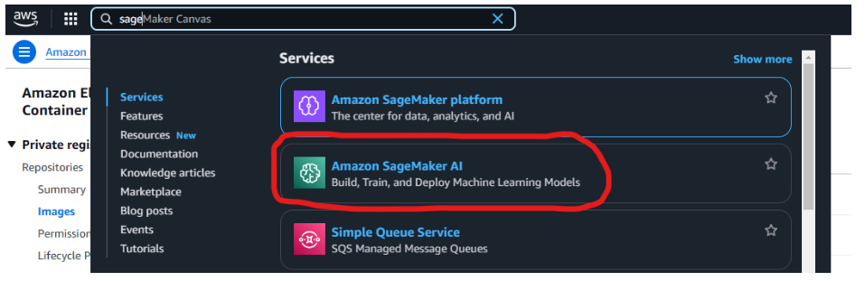
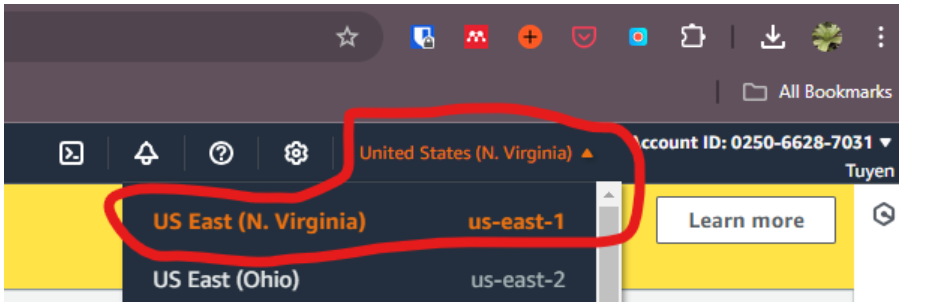
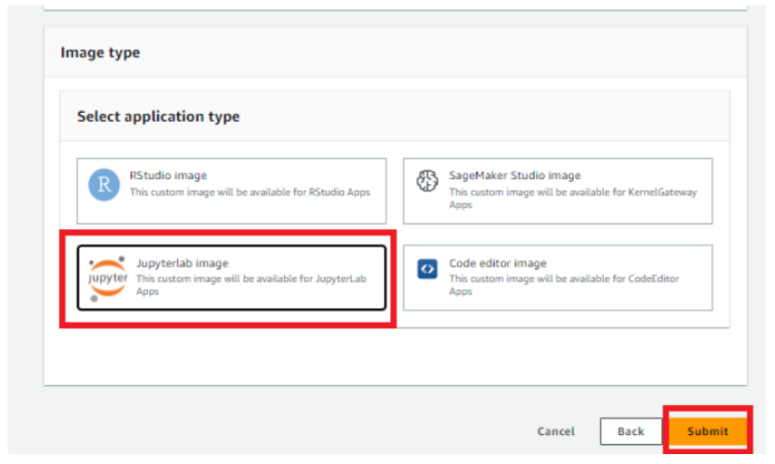

**Step 1:** Create the SageMaker notebook [set up AWS Sagemaker Studio](https://github.com/NIGMS/NIGMS-Sandbox/blob/main/docs/HowToCreateAWSSagemakerNotebooks.md#set-up-sagemaker-studio)

Docker uri: 025066287031.dkr.ecr.us-east-1.amazonaws.com/usd-phylogenetic-tree/custom-aws-tutorial:latest

**Step 2:** Open the terminal. Then clone the GitHub repo `git clone https://github.com/bicbioeng/nosi-phylogeny-draft.git`

**Step 3:** Run the tutorial, followed step by step from submodule 1 to submodule 4 notebook.

##### <u>Notices</u>:
     
**Note 1:** Choose the Amazon SageMaker AI 

**Note 2:** Choose the N. Virginia Region 

**Note 3:** Choose the jupyter notebook style 

**Note 4:** Use the correct image URI: <u>025066287031.dkr.ecr.us-east-1.amazonaws.com/usd-phylogenetic-tree/custom-aws-tutorial:latest</u> 

