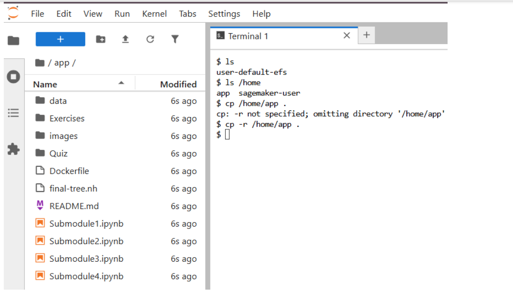
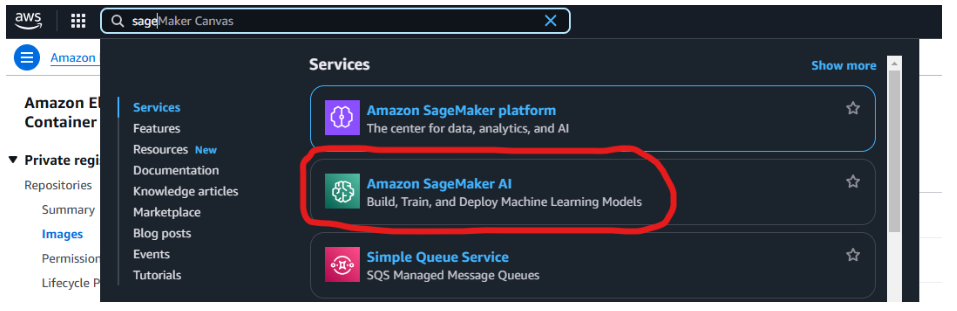
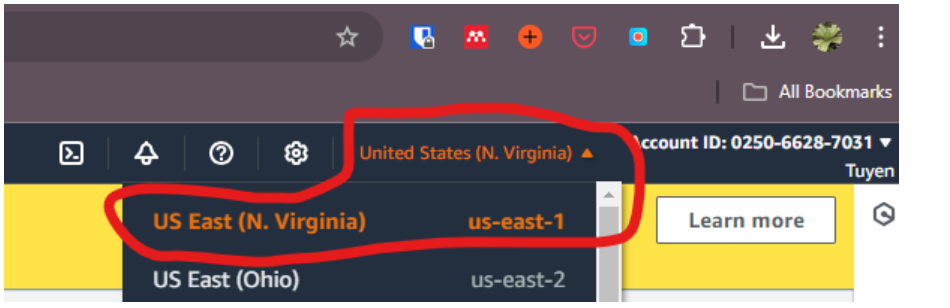
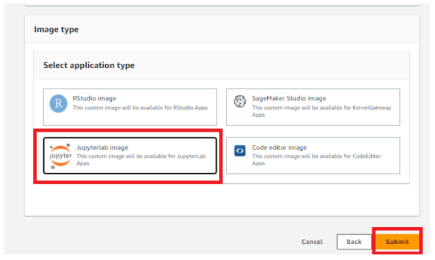
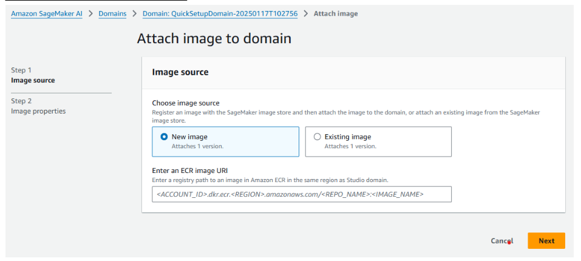

**Step 1:** Create the SageMaker notebook https://github.com/NIGMS/NIGMSSandbox/blob/main/docs/HowToCreateJupyterlabWithCustomImage.md

Docker uri: 025066287031.dkr.ecr.us-east-1.amazonaws.com/usd-phylogenetic-tree/custom-aws-tutorial:latest

**Step 2:** Run the tutorial, followed step by step from submodule 1 to submodule 4 notebook.

**Step 3:** Fill out the form under your name. 

##### <u>Notices</u>:
if you did not see the Submodule 1 - 4 files. They are in /home/app folder, you can copy all of them to your working folder by
- Open terminal 
- cp -r /home/app . 
     
REMEMBER INCLUDE THE DOT AT THE END OF COMMAND. If you cannot find the **/home/app** folder, just start again from the beginning to update the new image version. 

Please let me know if you have any questions. 

**Step 4:** Choose the Amazon SageMaker AI 

**Step 5:** Choose the N. Virginia Region 

**Step 6:** Choose the jupyter notebook style 

**Step 7:** Use the correct image URI: <u>025066287031.dkr.ecr.us-east-1.amazonaws.com/usd-phylogenetic-tree/custom-aws-tutorial:latest</u> 

